<p align="center">
  
</p>

<h1 align="center">Hi, I'm Aryan Dane 👋</h1>

<p align="center">
  <strong>SAP ABAP Developer</strong> · S/4HANA · RAP · Integrations · Clean Enterprise Code
</p>

## About me

I’m an SAP ABAP Developer focused on maintainable, upgrade-safe enterprise solutions. I enjoy turning business requirements into performant reports, integrations, enhancements, and Fiori-ready services.

- 🌱 Currently learning: ABAP Cloud, RAP, CDS Views, and SAP BTP
- 💬 Technical interests: ABAP OO, ALV, BAdIs, CDS, RAP, OData, BAPI/IDoc, and performance tuning
- 🧭 Profile: [@Danearyan25](https://github.com/Danearyan25)

## Skills

<p>
  
  
  
  
  
  
  
  
  
  
  
</p>

## Technical focus

| Area | What I build |
| --- | --- |
| **ABAP development** | Object-oriented ABAP, executable reports, ALV grids, background jobs, forms, and reusable utility classes. |
| **S/4HANA extensibility** | CDS-based data models, behavior definitions, RAP services, key-user/developer extensibility, and clean-core-minded enhancements. |
| **Integrations** | Synchronous and asynchronous interfaces using OData, REST, SOAP, RFC, BAPI, IDoc, and application logs. |
| **Performance & quality** | SQL and internal-table optimization, ST05/SAT analysis, ATC checks, ABAP Unit tests, and pragmatic code reviews. |
| **Delivery** | Transport-aware change design, Git-enabled ABAP workflows, technical documentation, and clear handover notes. |

## Engineering principles

```abap
" Prefer explicit interfaces, testable logic, and business-readable names.
DATA(order_service) = NEW zcl_order_service( io_repository = repository ).
DATA(result)        = order_service->validate_and_post( request ).

IF result-is_success = abap_false.
  RAISE EXCEPTION TYPE zcx_order_processing
    EXPORTING messages = result-messages.
ENDIF.
```

- Keep domain logic isolated from UI, database access, and integration adapters.
- Use CDS/RAP and released APIs where they fit; avoid unnecessary modification points.
- Design integrations for traceability: meaningful messages, application logs, and safe retry behavior.
- Measure performance before optimizing—especially database access inside loops.

## How I work

I care about clear communication, clean ABAP design, small reviewable transports, and documentation that helps functional and technical teammates move faster.

## SAP toolkit

- **Development:** ABAP Objects, reports, ALV, Smart Forms / Adobe Forms, BAdIs, user exits, enhancements
- **Data & services:** CDS Views, AMDP, OData, BAPI, IDoc, RFC, SOAP / REST APIs
- **Modern SAP:** S/4HANA, Fiori elements, RAP, ABAP Cloud, SAP BTP
- **Quality:** ATC / Code Inspector, ABAP Unit, performance analysis, Git-enabled workflows

---

<p align="center">
  <i>Thanks for stopping by — feel free to connect or explore my projects.</i>
</p>
